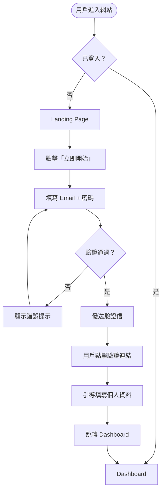
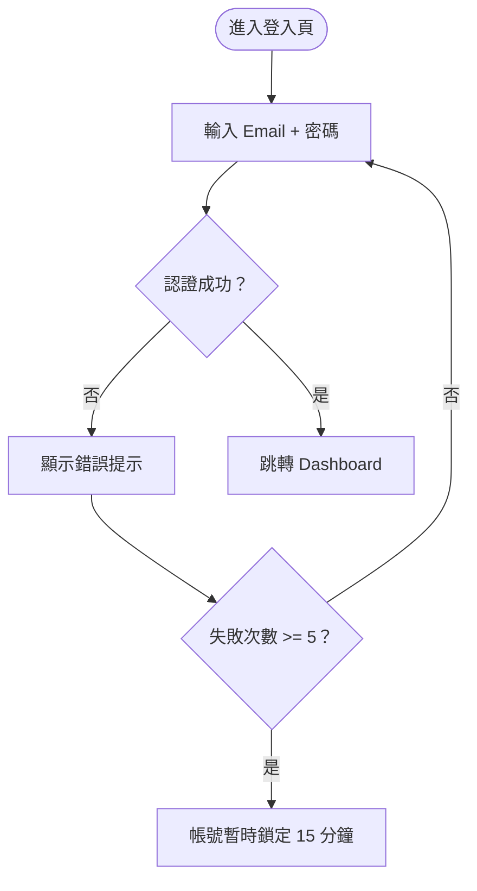
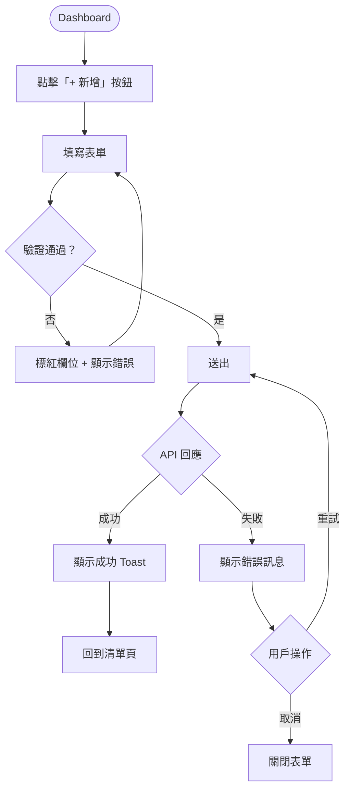
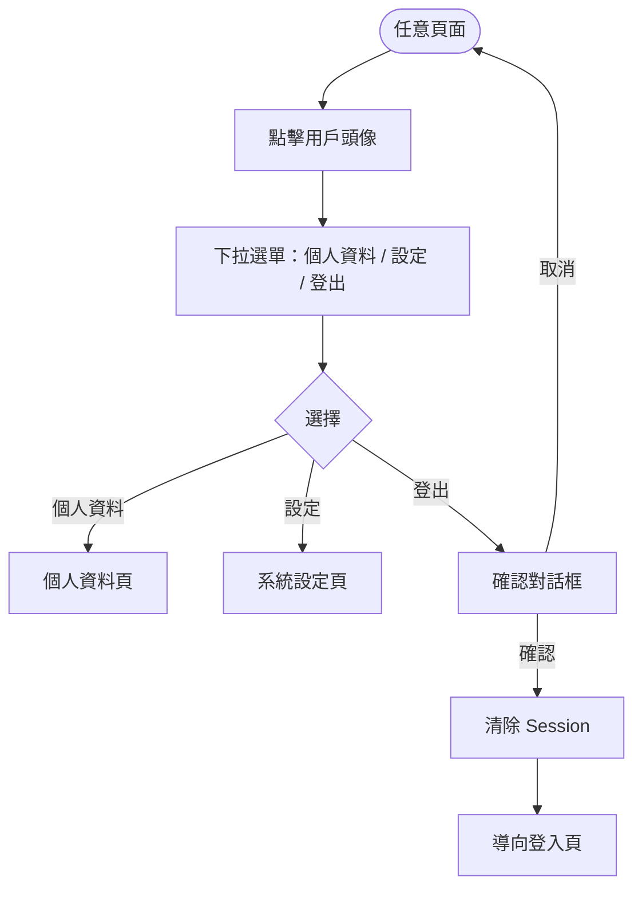

# User Flow — 使用者操作流程

## 主要使用者旅程

---

### 流程一：新用戶註冊 & 首次使用

**補充說明：**
- 若 Email 已被使用 → 提示「此 Email 已存在，是否登入？」並提供登入連結
- 驗證信 5 分鐘未點擊 → 提供「重新發送驗證信」按鈕
- 首次進入 Dashboard → 顯示 Onboarding 引導（可跳過）

---

### 流程二：一般登入

**補充說明：**
- 提供「忘記密碼」流程：輸入 Email → 寄重設連結 → 設定新密碼
- ⚠️ 推論：支援 Google SSO 登入（需求文件未明確說明，建議確認）

---

### 流程三：核心功能操作（以建立項目為例）

---

### 流程四：設定與個人資料

---

## 邊界情況處理

| 情境 | 預期行為 |
|------|----------|
| 網路中斷 | 顯示「網路連線中斷」提示，保留表單內容 |
| Session 過期 | 彈出「登入已逾時」modal，點擊後導向登入頁 |
| 無資料（空白狀態） | 顯示引導圖示 + 說明文字 + CTA 按鈕 |
| 無權限操作 | 顯示 403 提示，不顯示功能入口 |
| 重複提交（雙擊） | 送出後按鈕 disabled，防止重複請求 |

---

> ⚠️ 標記項目表示需求文件未明確說明、由 User Flow 合理推論，請確認後再實作。
