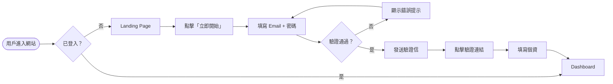

<div class="h-full flex flex-col justify-center items-center text-center">

<div class="text-6xl font-black mb-2 pb-4" style="background: linear-gradient(135deg, #6366f1, #8b5cf6, #ec4899); -webkit-background-clip: text; -webkit-text-fill-color: transparent;">
  AI Agentic Development
</div>

<div class="text-2xl font-semibold text-gray-300 mb-2">實戰操作指南</div>
<div class="text-lg text-gray-400 mb-8">從產品設計到部署的規格驅動開發完整流程</div>

<div class="flex gap-6 text-sm">
  <div class="px-4 py-2 rounded-full border border-purple-500/40 bg-purple-500/10 text-purple-300">
    課程：人本資訊系統與互動經驗設計
  </div>
  <div class="px-4 py-2 rounded-full border border-pink-500/40 bg-pink-500/10 text-pink-300">
    分享的人：念誠
  </div>
</div>

<div class="mt-10 text-gray-500 text-sm italic">
  「現階段規格是最重要的！一開始規格列得好，後面開發上會節省非常多時間。」
</div>

</div>

---
layout: default
transition: fade
---

# 念誠自我介紹

<div class="text-sm text-gray-400 mb-5">這一年多用 AI 做了幾個小專案，這次來分享我從中整理出來的流程。</div>

<div class="grid grid-cols-3 gap-3">

<a href="https://github.com/ncchen99/Tuckin" target="_blank" class="rounded-xl p-3 block transition-all hover:scale-[1.02]" style="background: rgba(99,102,241,0.1); border: 1px solid rgba(99,102,241,0.25); text-decoration: none;">
  <div class="flex items-center gap-2 mb-2">
    <span class="text-lg">🥕</span>
    <div>
      <div class="text-sm font-bold text-gray-200">Tuckin</div>
      <div class="text-xs text-indigo-400">2025.03</div>
    </div>
  </div>
  <div class="text-xs text-gray-400 mb-2">學生聚餐配對平台</div>
  <div class="flex gap-1 flex-wrap">
    <span class="text-xs px-1.5 py-0.5 rounded bg-gray-800 text-gray-400">Flutter</span>
    <span class="text-xs px-1.5 py-0.5 rounded bg-gray-800 text-gray-400">Supabase</span>
  </div>
</a>

<a href="https://github.com/ncchen99/InkSync" target="_blank" class="rounded-xl p-3 block transition-all hover:scale-[1.02]" style="background: rgba(139,92,246,0.1); border: 1px solid rgba(139,92,246,0.25); text-decoration: none;">
  <div class="flex items-center gap-2 mb-2">
    <span class="text-lg">🖼️</span>
    <div>
      <div class="text-sm font-bold text-gray-200">InkSync</div>
      <div class="text-xs text-purple-400">2025.12</div>
    </div>
  </div>
  <div class="text-xs text-gray-400 mb-2">分散式多裝置 E-Paper 控制系統</div>
  <div class="flex gap-1 flex-wrap">
    <span class="text-xs px-1.5 py-0.5 rounded bg-gray-800 text-gray-400">ESP32</span>
    <span class="text-xs px-1.5 py-0.5 rounded bg-gray-800 text-gray-400">Flutter</span>
  </div>
</a>

<a href="https://github.com/ncchen99/Campus-Shift-Scheduler" target="_blank" class="rounded-xl p-3 block transition-all hover:scale-[1.02]" style="background: rgba(245,158,11,0.1); border: 1px solid rgba(245,158,11,0.25); text-decoration: none;">
  <div class="flex items-center gap-2 mb-2">
    <span class="text-lg">📅</span>
    <div>
      <div class="text-sm font-bold text-gray-200">排班王</div>
      <div class="text-xs text-amber-400">2025.12</div>
    </div>
  </div>
  <div class="text-xs text-gray-400 mb-2">工讀生排班管理系統</div>
  <div class="flex gap-1 flex-wrap">
    <span class="text-xs px-1.5 py-0.5 rounded bg-gray-800 text-gray-400">React</span>
    <span class="text-xs px-1.5 py-0.5 rounded bg-gray-800 text-gray-400">Firebase</span>
  </div>
</a>

<a href="https://github.com/ncchen99/HMSSTC-Web" target="_blank" class="rounded-xl p-3 block transition-all hover:scale-[1.02]" style="background: rgba(16,185,129,0.1); border: 1px solid rgba(16,185,129,0.25); text-decoration: none;">
  <div class="flex items-center gap-2 mb-2">
    <span class="text-lg">🚀</span>
    <div>
      <div class="text-sm font-bold text-gray-200">HMSSTC</div>
      <div class="text-xs text-emerald-400">2026.02</div>
    </div>
  </div>
  <div class="text-xs text-gray-400 mb-2">夏漢民太空科技中心官方網站</div>
  <div class="flex gap-1 flex-wrap">
    <span class="text-xs px-1.5 py-0.5 rounded bg-gray-800 text-gray-400">Astro</span>
  </div>
</a>

<a href="https://github.com/ncchen99/NCKU-CA" target="_blank" class="rounded-xl p-3 block transition-all hover:scale-[1.02]" style="background: rgba(59,130,246,0.1); border: 1px solid rgba(59,130,246,0.25); text-decoration: none;">
  <div class="flex items-center gap-2 mb-2">
    <span class="text-lg">🎓</span>
    <div>
      <div class="text-sm font-bold text-gray-200">NCKU-CA</div>
      <div class="text-xs text-blue-400">2026.03</div>
    </div>
  </div>
  <div class="text-xs text-gray-400 mb-2">成大社聯會官方網站</div>
  <div class="flex gap-1 flex-wrap">
    <span class="text-xs px-1.5 py-0.5 rounded bg-gray-800 text-gray-400">Next.js</span>
    <span class="text-xs px-1.5 py-0.5 rounded bg-gray-800 text-gray-400">Firebase</span>
  </div>
</a>

<a href="https://github.com/ncchen99/Zplit" target="_blank" class="rounded-xl p-3 block transition-all hover:scale-[1.02]" style="background: rgba(236,72,153,0.1); border: 1px solid rgba(236,72,153,0.25); text-decoration: none;">
  <div class="flex items-center gap-2 mb-2">
    <span class="text-lg">💸</span>
    <div>
      <div class="text-sm font-bold text-gray-200">Zplit</div>
      <div class="text-xs text-pink-400">2026.04</div>
    </div>
  </div>
  <div class="text-xs text-gray-400 mb-2">固定朋友圈長期分帳平台</div>
  <div class="flex gap-1 flex-wrap">
    <span class="text-xs px-1.5 py-0.5 rounded bg-gray-800 text-gray-400">TypeScript</span>
    <span class="text-xs px-1.5 py-0.5 rounded bg-gray-800 text-gray-400">Firebase</span>
  </div>
</a>

</div>

<div class="mt-4 text-xs text-gray-600 text-center">許若仁董事長提過：『我們在專案中累積的，不應著重於技術和知識，而是該領域的見聞和想法。』</div>

---
layout: default
transition: fade
---

# 開發者角色的轉變

<div class="flex gap-12 items-center justify-center h-4/5">

<div class="text-center">
  <div class="text-5xl mb-4">💻</div>
  <div class="text-xl font-bold text-gray-400 mb-2">過去</div>
  <div class="text-2xl font-black text-gray-300">代碼農夫</div>
  <div class="mt-3 text-sm text-gray-500">專注於「怎麼寫」</div>
  <div class="text-sm text-gray-500">逐行撰寫代碼</div>
  <div class="text-sm text-gray-500">手動管理所有細節</div>
</div>

<div class="text-5xl text-purple-400">→</div>

<div class="text-center">
  <div class="text-5xl mb-4">🏛️</div>
  <div class="text-xl font-bold text-purple-400 mb-2">現在</div>
  <div class="text-2xl font-black text-purple-300">架構指揮官</div>
  <div class="mt-3 text-sm text-gray-400">專注於「做什麼」</div>
  <div class="text-sm text-gray-400">定義規格與邊界</div>
  <div class="text-sm text-gray-400">監督 AI 產出品質</div>
</div>

</div>

---
layout: default
transition: slide-up
---

# 完整流程總覽

<div class="grid grid-cols-4 gap-3 mt-4">

<v-click>
<div class="rounded-xl p-4 text-center" style="background: rgba(99,102,241,0.15); border: 1px solid rgba(99,102,241,0.4)">
  <div class="text-2xl mb-2">📁</div>
  <div class="text-xs text-indigo-400 font-bold mb-1">準備</div>
  <div class="text-sm font-semibold text-gray-200">資料夾結構</div>
</div>
</v-click>

<v-click>
<div class="rounded-xl p-4 text-center" style="background: rgba(139,92,246,0.15); border: 1px solid rgba(139,92,246,0.4)">
  <div class="text-2xl mb-2">📝</div>
  <div class="text-xs text-purple-400 font-bold mb-1">階段一</div>
  <div class="text-sm font-semibold text-gray-200">需求文件</div>
</div>
</v-click>

<v-click>
<div class="rounded-xl p-4 text-center" style="background: rgba(168,85,247,0.15); border: 1px solid rgba(168,85,247,0.4)">
  <div class="text-2xl mb-2">⚙️</div>
  <div class="text-xs text-violet-400 font-bold mb-1">階段二</div>
  <div class="text-sm font-semibold text-gray-200">技術 + 系統架構</div>
</div>
</v-click>

<v-click>
<div class="rounded-xl p-4 text-center" style="background: rgba(245,158,11,0.15); border: 1px solid rgba(245,158,11,0.4)">
  <div class="text-2xl mb-2">🎨</div>
  <div class="text-xs text-amber-400 font-bold mb-1">階段三</div>
  <div class="text-sm font-semibold text-gray-200">Wireframe + 設計稿</div>
</div>
</v-click>

<v-click>
<div class="rounded-xl p-4 text-center" style="background: rgba(16,185,129,0.15); border: 1px solid rgba(16,185,129,0.4)">
  <div class="text-2xl mb-2">🔗</div>
  <div class="text-xs text-emerald-400 font-bold mb-1">階段四</div>
  <div class="text-sm font-semibold text-gray-200">設計導出</div>
</div>
</v-click>

<v-click>
<div class="rounded-xl p-4 text-center" style="background: rgba(59,130,246,0.15); border: 1px solid rgba(59,130,246,0.4)">
  <div class="text-2xl mb-2">🤖</div>
  <div class="text-xs text-blue-400 font-bold mb-1">階段五</div>
  <div class="text-sm font-semibold text-gray-200">AI 代理開發</div>
</div>
</v-click>

<v-click>
<div class="rounded-xl p-4 text-center" style="background: rgba(20,184,166,0.15); border: 1px solid rgba(20,184,166,0.4)">
  <div class="text-2xl mb-2">🚀</div>
  <div class="text-xs text-teal-400 font-bold mb-1">階段六</div>
  <div class="text-sm font-semibold text-gray-200">部署應用程式</div>
</div>
</v-click>

</div>

---
layout: section
transition: slide-left
---

<div class="text-center">
  <div class="text-6xl mb-4">📁</div>
  <div class="text-4xl font-black text-indigo-400">專案資料夾結構規範</div>
  <div class="text-lg text-gray-400 mt-3">上下文工程（Context Engineering）的基礎</div>
</div>

---
layout: default
transition: fade
---

# 標準資料夾結構

<div class="mt-4">

```bash {all|1-6|7-12|13-14}
my-project/
├── specs/                    # 所有規格文件放這裡
│   ├── requirements.md       # 需求文件（做什麼＋驗收標準）
│   ├── SPEC.md               # 技術規格（技術選型、API 設計、元件清單）
│   ├── AGENTS.md             # AI 代理人角色指令與行為約束
│   └── tasks.md              # AI 規劃後產生的任務清單（待確認）
├── designs/                  # 所有設計資產放這裡
│   ├── DESIGN.md             # 設計系統規格（色彩、字體、間距）
│   ├── user-flow.md          # 使用者操作流程與頁面跳轉邏輯
│   ├── wireframes/           # 各頁面 Wireframe 描述（每頁一個 .md 檔）
│   └── stitches/             # Stitch 導出的 HTML/CSS/JS 視覺參考
├── figma/                    # Figma 相關資源（專業流程使用）
└── src/                      # 源代碼
```

</div>

<div class="mt-4 px-4 py-3 rounded-lg text-sm" style="background: rgba(99,102,241,0.1); border: 1px solid rgba(99,102,241,0.3)">
  💡 這個結構讓 AI 代理人能夠<span class="text-indigo-300 font-bold">跨檔案梳理邏輯</span>，是規格驅動開發的核心基礎。
</div>

---
layout: section
transition: slide-left
---

<div class="text-center">
  <div class="text-5xl mb-3">📝</div>
  <div class="text-xl text-purple-400 font-semibold mb-1">第一階段</div>
  <div class="text-4xl font-black text-gray-100">明確功能與需求文件</div>
  <div class="text-lg text-gray-400 mt-3">讓 AI 完全理解專案的靈魂與邊界</div>
</div>

---
layout: default
transition: fade
---

# 步驟 1.1 — 反覆討論，聚焦需求

<div class="mt-2 mb-4 text-gray-400 text-sm">關鍵：定義產品的<span class="text-purple-300">影響力</span>與<span class="text-purple-300">核心價值</span>，而非列功能清單</div>

<div class="grid grid-cols-2 gap-4">

<div>
<v-clicks>

<div class="mb-3 p-3 rounded-lg" style="background: rgba(139,92,246,0.1); border-left: 3px solid #8b5cf6">
  <div class="text-sm font-bold text-purple-300">🎯 核心問題</div>
  <div class="text-sm text-gray-300 mt-1">這個服務解決什麼問題？</div>
</div>

<div class="mb-3 p-3 rounded-lg" style="background: rgba(139,92,246,0.1); border-left: 3px solid #8b5cf6">
  <div class="text-sm font-bold text-purple-300">👥 使用者</div>
  <div class="text-sm text-gray-300 mt-1">主要使用者是誰？</div>
</div>

<div class="mb-3 p-3 rounded-lg" style="background: rgba(139,92,246,0.1); border-left: 3px solid #8b5cf6">
  <div class="text-sm font-bold text-purple-300">⭐ 優先功能</div>
  <div class="text-sm text-gray-300 mt-1">最重要的 3 個功能是什麼？</div>
</div>

<div class="p-3 rounded-lg" style="background: rgba(236,72,153,0.1); border-left: 3px solid #ec4899">
  <div class="text-sm font-bold text-pink-300">🚫 邊界定義</div>
  <div class="text-sm text-gray-300 mt-1">哪些事情是這個產品<strong>絕對不做</strong>的？</div>
</div>

</v-clicks>
</div>

<div>
<v-click>
<div class="p-4 rounded-xl h-full" style="background: rgba(17,24,39,0.8); border: 1px solid rgba(99,102,241,0.3)">
  <div class="text-xs text-indigo-400 font-bold mb-2">💬 範例提問方式</div>
  <div class="text-xs text-gray-400 italic leading-relaxed">
    「我想打造一個充滿正向交流的社群平台，請幫我釐清：什麼樣的機制能引導良性互動、減少負面情緒擴散？」
  </div>
</div>
</v-click>
</div>

</div>

---
layout: default
transition: fade
---

# 步驟 1.2 — 選擇 AI 工具整理想法

<div class="mt-4">

| 情境 | 推薦工具 | 原因 |
|------|----------|------|
| 快速發散、腦力激盪 | ChatGPT、Gemini | 通用型 LLM，回應速度快 |
| 複雜文件整理、長上下文 | Claude | 比較不會忘東忘西，Markdown 編輯能力卓越 |
| 大型專案、跨檔案梳理 | Cursor / Claude Code | Code Agent，支援跨檔案推理 |

</div>

<v-click>
<div class="mt-6">

### 步驟 1.3 — 產出 `requirements.md` 的 Prompt 範本

```md
請根據我們的討論，幫我整理一份完整的需求文件（requirements.md）。
格式要求：
- 產品背景與核心價值（為什麼要做這個？）
- 目標使用者描述
- 核心功能清單（按優先級排序）
- 各功能的驗收標準（Acceptance Criteria）
- 邊界情況與錯誤處理方式
- 明確的「不做清單」（Out of Scope）
請使用 Markdown 格式，確保邏輯嚴謹。
```

</div>
</v-click>

---
layout: section
transition: slide-left
---

<div class="text-center">
  <div class="text-5xl mb-3">⚙️</div>
  <div class="text-xl text-violet-400 font-semibold mb-1">第二階段</div>
  <div class="text-4xl font-black text-gray-100">技術選型與系統架構</div>
  <div class="text-lg text-gray-400 mt-3">一個 Prompt 同時搞定選型與架構規劃</div>
</div>

---
layout: default
transition: fade
---

# 系統規格文件 Prompt

```md {all|1|3-7|8-14}
請你閱讀 specs/requirements.md，幫我完成以下兩件事，並輸出至 specs/SPEC.md：

【一】技術選型
- 推薦最適合的技術架構（前端框架、後端方案、資料庫、第三方服務）
- 至少比較兩個後端方案，說明優缺點與取捨
- 特別考量：開發速度、維護成本、學習曲線

【二】系統架構規劃
- 整體系統架構（以 Mermaid 圖或文字描述）
- 前後端服務區塊劃分
- 主要資料流：前端 ↔ API ↔ 資料庫
- 外部服務清單與串接方式

SPEC.md 需包含：技術堆疊表、API 路由設計、資料庫 Schema 草稿。
```
---
layout: default
transition: fade
---

<a href="https://claude.ai/share/a813a3af-823f-4b3a-83e4-022d37dddbd8" target="_blank">
  
</a>

---
layout: section
transition: slide-left
---

<div class="text-center">
  <div class="text-5xl mb-3">🎨</div>
  <div class="text-xl text-amber-400 font-semibold mb-1">第三階段</div>
  <div class="text-4xl font-black text-gray-100">Wireframe 與設計稿</div>
  <div class="text-lg text-gray-400 mt-3">先規劃骨架，再生成視覺</div>
</div>

---
layout: default
transition: fade
---

# 介面規劃流程

<div class="flex items-center justify-between mt-6 gap-2">

<div class="flex-1 rounded-xl p-4 text-center" style="background: rgba(99,102,241,0.15); border: 1px solid rgba(99,102,241,0.4)">
  <div class="text-3xl mb-2">📄</div>
  <div class="text-sm font-bold text-indigo-300">Step 1</div>
  <div class="text-xs text-gray-400 mt-1">Wireframe<br>各頁面版面與元件</div>
</div>

<div class="text-gray-600 text-2xl">→</div>

<div class="flex-1 rounded-xl p-4 text-center" style="background: rgba(139,92,246,0.15); border: 1px solid rgba(139,92,246,0.4)">
  <div class="text-3xl mb-2">🗺️</div>
  <div class="text-sm font-bold text-purple-300">Step 2</div>
  <div class="text-xs text-gray-400 mt-1">User Flow<br>操作流程與跳轉邏輯</div>
</div>

<div class="text-gray-600 text-2xl">→</div>

<div class="flex-1 rounded-xl p-4 text-center" style="background: rgba(245,158,11,0.15); border: 1px solid rgba(245,158,11,0.4)">
  <div class="text-3xl mb-2">✨</div>
  <div class="text-sm font-bold text-amber-300">Step 3</div>
  <div class="text-xs text-gray-400 mt-1">挑 1–2 個關鍵頁面<br>交給 Stitch 生成</div>
</div>

<div class="text-gray-600 text-2xl">→</div>

<div class="flex-1 rounded-xl p-4 text-center" style="background: rgba(16,185,129,0.15); border: 1px solid rgba(16,185,129,0.4)">
  <div class="text-3xl mb-2">🔩</div>
  <div class="text-sm font-bold text-emerald-300">Step 4</div>
  <div class="text-xs text-gray-400 mt-1">補充 SPEC.md<br>元件拆解（Atomic Design）</div>
</div>

</div>

---
layout: default
transition: fade
---

# Step 1 — Wireframe Prompt

```md
請你閱讀 specs/requirements.md 和 specs/SPEC.md，
為每一個頁面撰寫 Wireframe 描述，每頁一個 .md 檔案，儲存至 designs/wireframes/。

每個頁面描述需包含：
1. 頁面用途與使用者情境
2. 整體版面配置（Header / 主內容區 / Sidebar 等空間關係）
3. 每個區塊的功能說明
4. 頁面上所有互動元件（按鈕、表單、連結等）及其行為
5. 空白狀態 / 載入中 / 錯誤狀態的處理方式

格式：使用條列式描述版面的空間關係，不需要視覺稿。
目的是讓後續的 AI 代碼代理人能依此推論出元件需求。
```

---
layout: default
transition: fade
---

# Wireframe 範例（Dashboard 頁面）

<div class="text-xs text-gray-500 mb-2">📄 <code>designs/wireframes/example-dashboard.md</code></div>

```
┌─────────────────────────────────────────────────────┐
│  [Logo]   [Nav: 首頁 / 歷史 / 設定]      [用戶頭像]     │  ← Header（固定頂部）
├──────────┬──────────────────────────────────────────┤
│          │  歡迎回來，{用戶名稱}                       │
│ Sidebar  │  ─────────────────────────────────────── │
│          │  [統計卡片 1]  [統計卡片 2]  [統計卡片 3]    │
│  [快捷    │                                          │
│   功能]   │  ─── 最近活動 ─────────────────────────── │
│          │  [活動項目 1]  時間戳 + 操作描述 + 狀態      │
│          │  [活動項目 2]                             │
│          │  [載入更多] 按鈕                           │
└──────────┴──────────────────────────────────────────┘
```

<div class="grid grid-cols-3 gap-2 mt-2 text-xs">
  <div class="p-2 rounded" style="background: rgba(99,102,241,0.1)">📌 載入中 → Skeleton 動畫</div>
  <div class="p-2 rounded" style="background: rgba(99,102,241,0.1)">📌 空白態 → 引導圖示 + CTA</div>
  <div class="p-2 rounded" style="background: rgba(99,102,241,0.1)">📌 錯誤 → 點擊重試</div>
</div>

---
layout: default
transition: fade
---

# Step 2 — User Flow Prompt

```md
請你閱讀 specs/requirements.md 和 designs/wireframes/，
為這個產品撰寫完整的使用者操作流程，儲存至 designs/user-flow.md。

文件需包含：
1. 主要使用者旅程（Happy Path）— 每個功能模塊一段
2. 每個步驟：使用者操作 → 系統回應
3. 分支情境：成功 / 失敗 / 邊界情況
4. 若需求文件未涵蓋的情境，請根據現有規則合理推論，並以 ⚠️ 標記

格式：優先使用 Mermaid flowchart 呈現主流程，
每個主功能獨立一個段落，段落下附文字補充說明。
```

---
layout: default
transition: fade
---

# User Flow 範例（新用戶註冊）

<div class="text-xs text-gray-500 mb-3">📄 <code>designs/user-flow.md</code></div>

<div class="transform scale-90 -origin-top">



</div>

---
layout: default
transition: fade
---

# Step 3 — Google Stitch 生成關鍵頁面

<div class="mb-3 p-3 rounded-lg text-sm" style="background: rgba(245,158,11,0.1); border: 1px solid rgba(245,158,11,0.3)">
  <span class="text-amber-400 font-bold">⭐ 策略：</span>
  <span class="text-gray-300">只挑元件最多、最複雜的 1–2 個頁面生成。其餘頁面由 AI 代碼代理人依設計語言延展。</span>
</div>

```md
請根據以下描述，生成高保真的 UI 介面設計：

🗂 頁面：[頁面名稱，如 Dashboard]
🎯 功能：[這個頁面的核心任務]
👤 使用者情境：[目標用戶在什麼狀況下使用]
📐 版面結構：[參考 designs/wireframes/ 中的描述]

設計規格（來自 designs/DESIGN.md）：
- 主色 / 背景色 / 強調色：[HEX]
- 字體 / 圓角 / 設計語言：[填入]

請生成完整頁面，包含所有互動元件，確保設計語言與 DESIGN.md 規格一致。
```

---
layout: default
transition: fade
---

# 設計風格取樣：Dribbble → DESIGN.md → Stitch

<div class="grid grid-cols-3 gap-3 mt-3">

<div class="text-center">
  <div class="rounded-xl p-4" style="background: rgba(99,102,241,0.1); border: 1px solid rgba(99,102,241,0.3)">
    <div class="text-3xl mb-2">🎨</div>
    <div class="text-sm font-bold text-indigo-300">Step A</div>
    <div class="text-xs text-gray-400 mt-1">從 Dribbble 找靈感<br>截圖儲存</div>
  </div>
</div>

<div class="text-center">
  <div class="rounded-xl p-4" style="background: rgba(139,92,246,0.1); border: 1px solid rgba(139,92,246,0.3)">
    <div class="text-3xl mb-2">🤖</div>
    <div class="text-sm font-bold text-purple-300">Step B</div>
    <div class="text-xs text-gray-400 mt-1">AI 解析設計 Token<br>存至 designs/DESIGN.md</div>
  </div>
</div>

<div class="text-center">
  <div class="rounded-xl p-4" style="background: rgba(236,72,153,0.1); border: 1px solid rgba(236,72,153,0.3)">
    <div class="text-3xl mb-2">✨</div>
    <div class="text-sm font-bold text-pink-300">Step C</div>
    <div class="text-xs text-gray-400 mt-1">將 DESIGN.md 內容<br>附在 Stitch Prompt 中</div>
  </div>
</div>

</div>

<v-click>

```md
請分析這張設計稿的設計系統，輸出以下參數存至 designs/DESIGN.md：
- 主色 / 輔助色 / 背景色（HEX）
- 字體系統（標題字重、內文字重、字級比例）
- 圓角（px）、間距系統（基礎單位）、陰影風格
- 設計語言關鍵字（minimalist / glassmorphism / neo-brutalism...）
```

</v-click>

---
layout: default
transition: fade
---

# Step 4 — 補充 SPEC.md 元件拆解（Atomic Design）

<div class="mb-3 text-sm text-gray-400">Wireframe 與設計稿完成後，讓 AI 補充前端元件規格，讓開發代理人有精確的拆分依據。</div>

```md
請你閱讀 designs/wireframes/ 和 designs/stitches/ 中的設計稿，
補充 specs/SPEC.md 的前端元件規格章節。

需補充的內容：
1. Atoms（基本元件）：不可再分割的基礎 UI 元件列表
2. Molecules（組合元件）：由 Atoms 組成的功能性元件
3. Organisms（複合區塊）：由 Molecules 組成的頁面區塊
4. Pages（頁面）：路由 + 對應的主要 Organisms
5. 元件複用規則：哪些跨頁面共用？哪些是頁面專屬？

請對應到 wireframes/ 中的實際頁面描述，讓每個元件都能追溯到具體的設計需求。
```

---
layout: section
transition: slide-left
---

<div class="text-center">
  <div class="text-5xl mb-3">🔗</div>
  <div class="text-xl text-emerald-400 font-semibold mb-1">第四階段</div>
  <div class="text-4xl font-black text-gray-100">設計導出</div>
  <div class="text-lg text-gray-400 mt-3">選擇適合你的工作流程</div>
</div>

---
layout: default
transition: fade
---

# 設計導出方案

<div class="grid grid-cols-2 gap-5 mt-4">

<div class="rounded-xl p-4" style="background: rgba(16,185,129,0.07); border: 1px solid rgba(16,185,129,0.35)">
  <div class="text-emerald-400 font-bold text-base mb-1">方案一：專業流程</div>
  <div class="text-gray-400 text-xs mb-3">Figma + MCP｜中大型專案、長期維護</div>
  <div class="space-y-2">
    <div class="p-2 rounded text-sm" style="background: rgba(16,185,129,0.1)">✅ Stitch 導出 → 匯入 Figma</div>
    <div class="p-2 rounded text-sm" style="background: rgba(16,185,129,0.1)">✅ 設定 Figma MCP Server</div>
    <div class="p-2 rounded text-sm" style="background: rgba(16,185,129,0.1)">✅ IDE 連接 MCP，AI 讀取設計數據</div>
  </div>
  <div class="mt-3 p-2 rounded text-xs" style="background: rgba(16,185,129,0.15); border: 1px solid rgba(16,185,129,0.3)">
    <span class="text-emerald-400 font-bold">MCP 優勢：</span>
    <span class="text-gray-300">AI 精準抓取設計數據，Code Connect 確保元件一致。</span>
  </div>
</div>

<div class="rounded-xl p-4" style="background: rgba(99,102,241,0.07); border: 1px solid rgba(99,102,241,0.35)">
  <div class="text-indigo-400 font-bold text-base mb-1">方案二：敏捷流程</div>
  <div class="text-gray-400 text-xs mb-3">直接打包｜小型專案、課堂練習、快速原型</div>
  <div class="space-y-2">
    <div class="p-2 rounded text-sm" style="background: rgba(99,102,241,0.1)">✅ Stitch Export → Download as HTML</div>
    <div class="p-2 rounded text-sm" style="background: rgba(99,102,241,0.1)">✅ 解壓縮 → <code>designs/stitches/</code></div>
    <div class="p-2 rounded text-sm" style="background: rgba(99,102,241,0.1)">✅ 作為 AI 的視覺規格參考</div>
  </div>
  <div class="mt-3 p-2 rounded text-xs" style="background: rgba(99,102,241,0.15); border: 1px solid rgba(99,102,241,0.3)">
    <span class="text-indigo-400 font-bold">注意：</span>
    <span class="text-gray-300">HTML/CSS 是視覺規格參考，AI 後續會重構為正式 React/Vue 元件。</span>
  </div>
</div>

</div>

---
layout: section
transition: slide-left
---

<div class="text-center">
  <div class="text-5xl mb-3">🤖</div>
  <div class="text-xl text-blue-400 font-semibold mb-1">第五階段</div>
  <div class="text-4xl font-black text-gray-100">AI 代理人開發實踐</div>
  <div class="text-lg text-gray-400 mt-3">三個階段，分批交付、分批驗收</div>
</div>

---
layout: default
transition: fade
---

# 工具選擇

<div class="text-sm text-gray-400 mb-4">選哪個都 OK，核心理念相同：AI 讀取全局規格、分階段交付</div>

<div class="grid grid-cols-4 gap-3">

<div class="rounded-xl p-3 text-center" style="background: rgba(99,102,241,0.1); border: 1px solid rgba(99,102,241,0.3)">
  <div class="h-8 mb-1 flex justify-center items-center">
    
  </div>
  <div class="text-sm font-bold text-indigo-300">Cursor</div>
  <div class="text-xs text-gray-500 mt-1">VS Code Fork<br>Deep Indexing</div>
</div>

<div class="rounded-xl p-3 text-center" style="background: rgba(59,130,246,0.1); border: 1px solid rgba(59,130,246,0.3)">
  <div class="h-8 mb-1 flex justify-center items-center">
    
  </div>
  <div class="text-sm font-bold text-blue-300">AntiGravity</div>
  <div class="text-xs text-gray-500 mt-1">Google Agent<br>Plan Mode</div>
</div>

<div class="rounded-xl p-3 text-center" style="background: rgba(16,185,129,0.1); border: 1px solid rgba(16,185,129,0.3)">
  <div class="h-8 mb-1 flex justify-center items-center">
    
  </div>
  <div class="text-sm font-bold text-emerald-300">VS Code</div>
  <div class="text-xs text-gray-500 mt-1">Copilot / Cline<br>Extension</div>
</div>

<div class="rounded-xl p-3 text-center" style="background: rgba(245,158,11,0.1); border: 1px solid rgba(245,158,11,0.3)">
  <div class="h-8 mb-1 flex justify-center items-center">
    
  </div>
  <div class="text-sm font-bold text-amber-300">Claude Code</div>
  <div class="text-xs text-gray-500 mt-1">Anthropic CLI<br>Terminal-first</div>
</div>

<div class="rounded-xl p-3 text-center" style="background: rgba(139,92,246,0.1); border: 1px solid rgba(139,92,246,0.3)">
  <div class="h-8 mb-1 flex justify-center items-center">
    
  </div>
  <div class="text-sm font-bold text-purple-300">Codex</div>
  <div class="text-xs text-gray-500 mt-1">OpenAI<br>Web + API</div>
</div>

<div class="rounded-xl p-3 text-center" style="background: rgba(236,72,153,0.1); border: 1px solid rgba(236,72,153,0.3)">
  <div class="h-8 mb-1 flex justify-center items-center">
    
  </div>
  <div class="text-sm font-bold text-pink-300">OpenCode</div>
  <div class="text-xs text-gray-500 mt-1">開源<br>Terminal</div>
</div>

<div class="rounded-xl p-3 text-center" style="background: rgba(20,184,166,0.1); border: 1px solid rgba(20,184,166,0.3)">
  <div class="h-8 mb-1 flex justify-center items-center">
    
  </div>
  <div class="text-sm font-bold text-teal-300">Windsurf</div>
  <div class="text-xs text-gray-500 mt-1">Codeium<br>Flow 模式</div>
</div>

</div>

---
layout: default
transition: fade
---

# 開始前：先讓 AI 產出計畫

<div class="mb-3 p-3 rounded-lg text-sm" style="background: rgba(99,102,241,0.1); border: 1px solid rgba(99,102,241,0.3)">
  📌 在執行任何一個 Phase 之前，先讓 AI 閱讀全部文件、產出 <code>specs/tasks.md</code>，人工確認後再開始。
</div>

```md
請你參考以下所有文件，在開始寫代碼之前，先輸出 specs/tasks.md 計畫：

📁 specs/requirements.md — 產品需求與驗收標準
📁 specs/SPEC.md — 技術規格（技術選型、API 設計、元件清單）
📁 designs/DESIGN.md — 設計系統規格
📁 designs/wireframes/ — 各頁面線框圖描述
📁 designs/user-flow.md — 使用者操作流程
📁 designs/stitches/ — 關鍵頁面視覺參考（HTML/CSS）

tasks.md 需包含：各開發階段任務清單（前端 → 後端）、
每個任務的預計產出與驗收標準、跨任務的依賴關係。

等我確認 tasks.md 無誤後，再開始執行 Phase 1。
```

---
layout: default
transition: fade
---

# Phase 1 — 建立設計語言

<div class="mb-3 text-gray-400 text-sm">以 Stitch 關鍵頁面為基準，建立設計系統與核心 UI</div>

```md
【Phase 1：建立設計語言與核心頁面】

請閱讀以下文件，根據 designs/stitches/ 的關鍵頁面，完成前端基礎建設：

📁 specs/SPEC.md — 前端元件清單（Atomic Design）
📁 designs/DESIGN.md — 設計系統規格（色彩、字體、間距）
📁 designs/stitches/ — 關鍵頁面視覺參考

請完成：
1. 設計系統基礎（色彩、字體、間距 CSS Token）
2. Atoms 元件庫（Button、Input、Badge 等基礎元件）
3. 以 stitches/ 的關鍵頁面為基準，完成最重要頁面的完整 UI 實作

⏸ 完成後請告知，等待人工確認樣式與設計語言，再繼續 Phase 2。
```

<v-click>
<div class="mt-3 p-3 rounded-lg text-sm" style="background: rgba(16,185,129,0.1); border: 1px solid rgba(16,185,129,0.3)">
  ✅ 人工介入點：確認樣式 → <strong>將設計語言固定下來</strong> → 進入 Phase 2
</div>
</v-click>

---
layout: default
transition: fade
---

# Phase 2 — 建立完整頁面

<div class="mb-3 text-gray-400 text-sm">設計語言確認後，依 Wireframe 建立所有其餘頁面</div>

```md
【Phase 2：建立完整前端頁面】

設計語言已確認。請依照 designs/wireframes/ 的規格，
使用已建立的元件庫與設計語言，完成所有其餘頁面：

📁 designs/wireframes/ — 各頁面版面與功能描述
📁 designs/user-flow.md — 頁面間的跳轉邏輯與路由設計
📁 specs/SPEC.md — API 路由設計（用於配置頁面路由）

建立規則：
1. 所有元件優先從已建立的元件庫中取用
2. 若需新元件，請先告知後再建立
3. 每完成一個主要頁面，請告知進度

⏸ 完成後請告知，等待確認介面與功能無誤後，再繼續 Phase 3。
```

---
layout: default
transition: fade
---

# Phase 3 — 建立後端與資料層

<div class="mb-3 text-gray-400 text-sm">前端介面確認後，依序建立資料模型、後端服務元件，最後將 API 與前端串接起來</div>

```md
【Phase 3：建立後端、資料層與 API 串接】

前端介面已確認。請依以下順序開發後端：

📁 specs/SPEC.md — API 路由設計、資料庫 Schema、元件清單
📁 specs/AGENTS.md — 操作權限規則（最小權限原則）

【3-A】資料模型建立
- 依 SPEC.md 的 Schema 草稿，建立完整的資料庫 Schema
- 每張資料表需包含：欄位定義、型別、索引、關聯關係
- 建立對應的 TypeScript / 語言 型別定義（types/models）

【3-B】後端 Service 元件
- 為每個業務模塊建立獨立的 Service 層（AuthService、UserService...）
- 每個 Service 負責：資料庫操作 + 商業邏輯 + 錯誤處理
- 遵守 AGENTS.md 的最小權限原則

【3-C】API 路由與前端串接
- 依 SPEC.md 的 API 路由設計，逐一實作並串接前端
- 每條路由完成後，確認前端對應頁面資料正確顯示

⏸ 每個子階段（3-A / 3-B / 3-C）完成後請告知，等待驗收確認後再繼續。
```

---
layout: default
transition: fade
---

# 人工審查 + AGENTS.md 安全規則

<div class="grid grid-cols-2 gap-5 mt-3">

<div>
<div class="text-sm font-bold text-blue-400 mb-2">✅ 每個 Phase 的審查重點</div>

<v-clicks>

<div class="text-sm p-2 rounded mb-2" style="background: rgba(59,130,246,0.1)">
  Phase 1：樣式 / 設計語言是否符合預期？
</div>
<div class="text-sm p-2 rounded mb-2" style="background: rgba(59,130,246,0.1)">
  Phase 2：頁面功能 / 跳轉邏輯是否正確？
</div>
<div class="text-sm p-2 rounded mb-2" style="background: rgba(59,130,246,0.1)">
  Phase 3：API 串接 / 資料讀寫是否正常？
</div>
<div class="text-sm p-2 rounded" style="background: rgba(59,130,246,0.1)">
  全程：技術選型是否與 SPEC.md 一致？
</div>

</v-clicks>
</div>

<div>
<v-click>
<div class="text-sm font-bold text-red-400 mb-2">🔒 AGENTS.md 安全規則</div>

```md
## 最小權限原則
- 讀取代理：僅具備 read 權限
- 寫入代理：僅特定資料表 write
- 禁止 admin 或全局刪除權限

## 決策邊界
- Schema 修改：必須人工確認
- 環境變數：禁止硬編碼

## 授權框架
- 使用 OAuth 2.1
- 細粒度 Scope（read:transactions）
```

</v-click>
</div>

</div>

---
layout: section
transition: slide-left
---

<div class="text-center">
  <div class="text-5xl mb-3">📋</div>
  <div class="text-xl text-teal-400 font-semibold mb-1">附錄</div>
  <div class="text-4xl font-black text-gray-100">規格文件命名規範與模板</div>
</div>

---
layout: default
transition: fade
---

# 文件命名規則

<div class="mt-4 text-sm">

| 文件 | 路徑 | 說明 |
|------|------|------|
| 需求文件 | `specs/requirements.md` | 定義「做什麼」與驗收標準 |
| 技術規格 | `specs/SPEC.md` | 技術選型、API 設計、元件清單 |
| 代理人規範 | `specs/AGENTS.md` | 代理人角色指令與行為約束 |
| 任務清單 | `specs/tasks.md` | AI 生成的任務規劃（待人工確認） |
| 設計系統 | `designs/DESIGN.md` | 色彩、字體、間距、元件規則 |
| 線框圖 | `designs/wireframes/` | 各頁面版面與元件描述（每頁一檔） |
| 操作流程 | `designs/user-flow.md` | 使用者操作流程與頁面跳轉邏輯 |

</div>

---
layout: default
transition: fade
---

# `requirements.md` 優先級結構

<div class="mb-4 text-sm text-gray-400">用 P0 / P1 / P2 區分功能優先級，讓 AI 知道什麼必須做、什麼可以之後再說。</div>

```md
### 🔴 P0 — 必須有（MVP）
- [ ] 功能名稱：[說明這個功能解決什麼問題]
      驗收標準：[如何確認這個功能完成了？]

### 🟡 P1 — 應該有（重要但非核心）
- [ ] 功能名稱：[說明]

### 🟢 P2 — 有更好（未來規劃）
- [ ] 功能名稱：[說明]
```

<v-click>
<div class="mt-4 p-3 rounded-lg text-sm" style="background: rgba(99,102,241,0.1); border: 1px solid rgba(99,102,241,0.3)">
  💡 驗收標準是最重要的部分：讓 AI 知道「什麼叫做完成」，才能自我驗證輸出是否達標。
</div>
</v-click>

---
layout: default
transition: fade
---

# 快速檢查清單

<div class="grid grid-cols-3 gap-3 mt-3 text-xs">

<div class="rounded-xl p-3" style="background: rgba(139,92,246,0.1); border: 1px solid rgba(139,92,246,0.3)">
  <div class="text-purple-400 font-bold mb-2 text-sm">準備 + 階段 1–2</div>
  <div class="space-y-1 text-gray-300">
    <div>☐ 資料夾結構已建立</div>
    <div>☐ requirements.md 存在</div>
    <div>☐ 功能按優先級排序</div>
    <div>☐ 技術選型已確認</div>
    <div>☐ SPEC.md 含架構 + API 設計</div>
  </div>
</div>

<div class="rounded-xl p-3" style="background: rgba(245,158,11,0.1); border: 1px solid rgba(245,158,11,0.3)">
  <div class="text-amber-400 font-bold mb-2 text-sm">階段 3–4</div>
  <div class="space-y-1 text-gray-300">
    <div>☐ wireframes/ 各頁面描述完成</div>
    <div>☐ user-flow.md 完成</div>
    <div>☐ 關鍵頁面設計稿已生成</div>
    <div>☐ DESIGN.md 含設計 Token</div>
    <div>☐ SPEC.md 含 Atomic Design</div>
    <div>☐ stitches/ 或 Figma 就緒</div>
  </div>
</div>

<div class="rounded-xl p-3" style="background: rgba(59,130,246,0.1); border: 1px solid rgba(59,130,246,0.3)">
  <div class="text-blue-400 font-bold mb-2 text-sm">階段 5</div>
  <div class="space-y-1 text-gray-300">
    <div>☐ tasks.md 已人工確認</div>
    <div>☐ Phase 1：設計語言確認</div>
    <div>☐ Phase 2：所有頁面完成</div>
    <div>☐ Phase 3：資料層串接完成</div>
    <div>☐ AGENTS.md 安全規則已設定</div>
  </div>
</div>

</div>

---
layout: center
transition: fade
---

<div class="text-center">

<div class="text-4xl font-black mb-6" style="background: linear-gradient(135deg, #6366f1, #8b5cf6, #ec4899); -webkit-background-clip: text; -webkit-text-fill-color: transparent;">
  開始你的 Vibe Coding 之旅
</div>

<div class="text-lg text-gray-400 max-w-xl mx-auto mb-8 italic">
  「沒有任何時間比現在更早開始。即使不是完美的方法，我們也必須努力應用在專案上，畢竟改善世界才是專案的目標。」
</div>

<div class="flex gap-4 justify-center flex-wrap">
  <div class="px-4 py-2 rounded-full text-sm" style="background: rgba(99,102,241,0.2); border: 1px solid rgba(99,102,241,0.4); color: #a5b4fc">
    📁 建立資料夾結構
  </div>
  <div class="px-4 py-2 rounded-full text-sm" style="background: rgba(139,92,246,0.2); border: 1px solid rgba(139,92,246,0.4); color: #c4b5fd">
    📝 寫下第一份需求
  </div>
  <div class="px-4 py-2 rounded-full text-sm" style="background: rgba(236,72,153,0.2); border: 1px solid rgba(236,72,153,0.4); color: #f9a8d4">
    🤖 讓 AI 開始工作
  </div>
</div>

<div class="mt-8 text-gray-600 text-xs">
  2026 Vibe Coding 實戰操作指南 · 適用上半年
</div>

</div>
