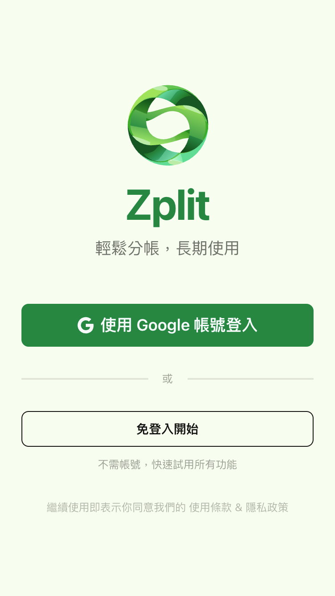
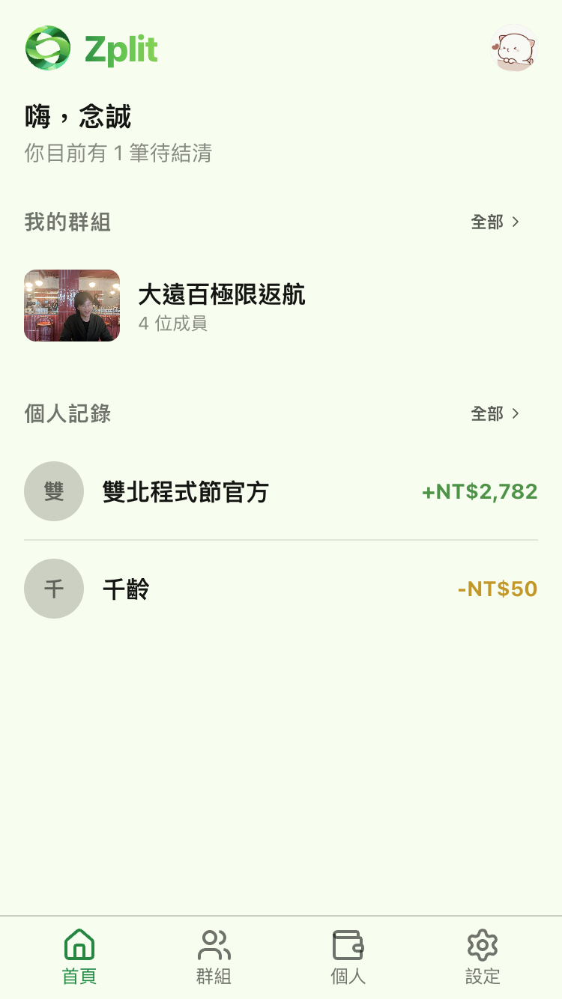
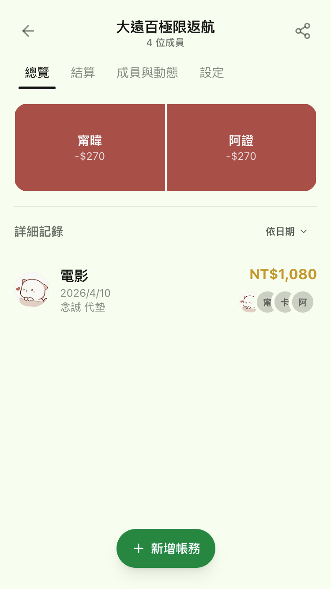
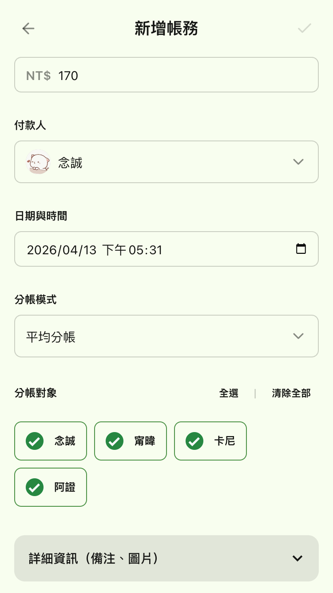

# 開發了一款分帳 App，然後呢？

從 Zplit 看我們如何把簡單問題複雜化

---
layout: default
transition: fade
---

# 故事是這樣開始的...

- 上週準備繳卡費，發現帳戶餘額不足 💸
- 開始追查錢的去向：原來都是幫朋友代墊惹的禍（活動、租屋水電）
- 心念一轉：與其抱怨對方沒還，不如我來主動記錄！

---
layout: default
transition: fade
---

# 燃燒 Token 的開發週末

- 決定做一個網頁版 App 當作統一的「記帳 Hub」
- 想像著未來出遊可以邀請大家一起用，超級興奮！
- 耗時兩天半，燒光幾乎所有 Token 打造出成品
- 這裡看成果：[Zplit 登入頁面](https://zplit.web.app/login)

  

---
layout: default
transition: fade
---

# Zplit 功能展示

  
  
  
  

---
layout: default
transition: fade
---

# 開發過程的意外收穫

雖然很累，但也解鎖了不少技能：

- UI/UX 的設計技巧 🎨
- Vibe Coding 的流程設計
- Context Management (上下文管理) 的實戰心得

---
layout: default
transition: fade
---

# 夢醒時分：Google 搜尋的暴擊

- 某天早上好奇 Google 了一下 "Zplit"
- 發現滿山滿谷**一模一樣**的分帳 App！
- 第一名甚至是成熟的免付費 SaaS：
  - 支援語音輸入
  - 支援直接上傳收據
  - （而且看起來也是 Vibe Coding 的產物...）

---
layout: default
transition: fade
---

# 搜尋結果對照

  
  

---
layout: default
transition: fade
---

# 小丑竟是我自己 🤡

- 以為是曠世巨作，其實是「重新造輪子」
- 犯了開發產品的大忌：
  - **還沒搞清楚要解決的問題，就一股腦投入開發**
- 搜尋時應多平台嘗試不同關鍵字，僅靠單一詞彙或翻譯往往難以找到目標。

---
layout: default
transition: fade
---

# 我真正需要的是什麼？

- 其實......我只缺一張黏在桌上的紙條。
- 核心需求只是「記錄誰欠我多少錢」。
- 做了這個 App 有幫助還款嗎？**沒有。**
  - 朋友來家裡，我還是忘了提。
  - App 沒提醒我，也不知道我什麼時候會見到朋友。

---
layout: default
transition: fade
---

# 科技的本末倒置現象

我們是不是常用錯方法解決問題，讓自己更累？

- **生產力工具**：本該讓生活輕鬆 ➡️ 卻製造出更多工作
- **社群平臺**：本該輕鬆交友 ➡️ 卻讓人更焦慮、花費更多心力

---
layout: default
transition: fade
---

# 一個重要的靈魂拷問

「我真正想要的是什麼？這樣的工具對我是正向的，還是負向的影響？」

---
layout: default
transition: fade
---

# 借鏡別人的血淚史

強烈推薦這個分享，完美命中這次專案遇到的痛點！

- 🎬 **YouTube 影片**：[Debug 土撥鼠 的分享](https://www.youtube.com/watch?v=FR3q4mGQRUI)
- 📝 **不想看影片的文字版**：[HackMD 筆記整理](https://hackmd.io/@RainBowT/ry4buHsoZg)

  
  

---
layout: default
transition: fade
---

# 痛定思痛的 3 個結論

- **看透本質**：思考「想解決的問題本質是什麼」，才是一切的開端。
- **重點是通路**：對於產品，現在的決勝點已經不是「怎麼做」，而是如何進行 **Distribution**。
- **不要只做 MVP**：不要只做出可以動的東西 (MVP)。
  - 請做 **MLP (Minimal Lovable Product)** —— 最低限度但讓人愛不釋手的產品！

---
layout: default
---

# Thank You!
（回去撕紙條記帳了 ✍️）